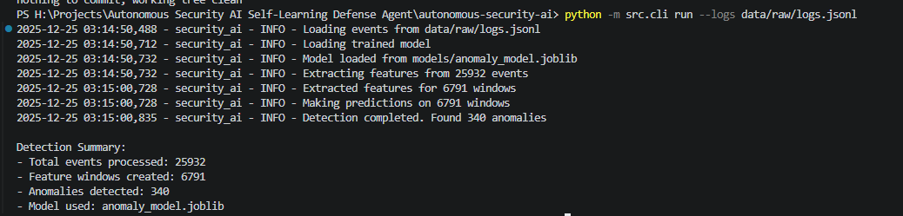
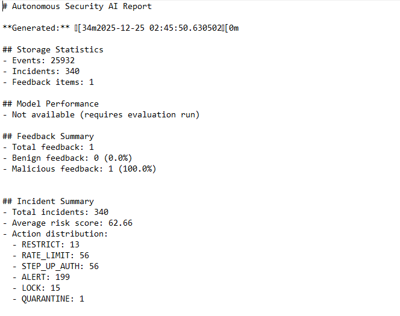

# Autonomous Security AI: Self-Learning Defense Agent


## What problem it solves

This project implements an autonomous security agent that continuously monitors system activity, learns normal behavior patterns using unsupervised learning, detects anomalies in real-time, automatically responds to threats based on policy rules, and adapts its behavior through a feedback loop. The system provides comprehensive security monitoring without requiring labeled training data, making it suitable for detecting previously unknown attack patterns and insider threats.

## Architecture Diagram

```
┌─────────────────┐    ┌─────────────────┐    ┌─────────────────┐
│   Event Log     │───▶│  Feature        │───▶│  Anomaly        │
│   Generator     │    │  Engineering    │    │  Detection      │
│  (Simulator)    │    │                 │    │  (Isolation     │
└─────────────────┘    └─────────────────┘    │   Forest)       │
                                              └─────────────────┘
                                                      │
                                                      ▼
┌─────────────────┐    ┌─────────────────┐    ┌─────────────────┐
│  Policy Engine  │◀───│  Explainability │    │  Incident       │
│  (Action Rules) │    │  (Top Features) │    │  Management     │
└─────────────────┘    └─────────────────┘    └─────────────────┘
        │                       │                       │
        ▼                       ▼                       ▼
┌─────────────────┐    ┌─────────────────┐    ┌─────────────────┐
│  Security       │    │  Feedback       │    │  Model          │
│  Actions       │    │  Loop           │    │  Retraining     │
│  (LOCK,        │    │  (Review,       │    │  (Adaptation)   │
│   QUARANTINE,   │    │   Retune)       │    │                 │
│   etc.)         │    └─────────────────┘    └─────────────────┘
└─────────────────┘
```

## How to run demo (3 commands)

1. **Simulate**: Generate synthetic security logs with various anomaly scenarios
   ```bash
   python -m src.cli simulate --out data/raw/logs.jsonl --days 7 --users 50 --anomaly-rate 0.05
   ```

2. **Train**: Train the anomaly detection model on the generated logs
   ```bash
   python -m src.cli train --logs data/raw/logs.jsonl
   ```

3. **Run**: Detect anomalies in the logs using the trained model
   ```bash
   python -m src.cli run --logs data/raw/logs.jsonl
   ```

## Example output snippets

### Simulation Output:
```
2025-12-25 02:41:32,727 - security_ai - INFO - Starting simulation: 7 days, 50 users, 0.05 anomaly rate
2025-12-25 02:41:32,958 - security_ai - INFO - Generated 25932 events with anomalies
```

### Training Output:
```
2025-12-25 02:41:43,068 - security_ai - INFO - Extracted features for 6791 windows
2025-12-25 02:41:43,173 - security_ai - INFO - Model training completed. Samples: 6791, F1 Score: 0.098
```

### Detection Output:
```
Detection Summary:
- Total events processed: 25932
- Feature windows created: 6791
- Anomalies detected: 340
- Model used: anomaly_model.joblib
```

### Incident Management:
```
Incident Details:
ID: 5f5cd2e4-dd74-4124-912c-cf095be96cc1
Actor: user_0004
Risk Score: 89.89
Action Taken: RESTRICT
Explanation: Unusual data access patterns. Key indicators: bytes_out_total=112702550.63, rolling_bytes_out_mean=112702550.63, bytes_out_rate=22540510.13. Risk score: 89.89/100.
Top Features: bytes_out_total, rolling_bytes_out_mean, bytes_out_rate, bytes_out_to_in_ratio, bytes_in_total
Feedback Status: malicious
```

## Explanation of anomaly scenarios

The system can detect 8+ different anomaly scenarios:

1. **Brute Force Login**: Rapid successive login attempts from same IP
2. **Credential Stuffing**: Multiple login attempts with different credentials
3. **Impossible Travel**: Logins from geographically distant locations in short time
4. **Data Exfiltration**: Unusually high data download/upload volumes
5. **Privilege Escalation**: Unauthorized access to higher privilege resources
6. **Resource Abuse Spike**: Sudden increase in resource usage beyond baseline
7. **Lateral Movement**: Unusual access patterns across different system resources
8. **Insider Sensitive Sweep**: Access to multiple sensitive resources by internal users

## How autonomy + feedback loop works

### Autonomy:
- The system automatically learns normal behavior patterns using unsupervised learning
- Detects anomalies in real-time without human intervention
- Applies security actions based on configurable policy rules
- Maintains and updates its knowledge base automatically

### Feedback Loop:
- Security analysts can review and mark incidents as benign or malicious
- The system learns from this feedback to improve future detection
- Policy thresholds are automatically adjusted based on feedback patterns
- Models are retrained periodically to adapt to changing behavior patterns

The feedback loop enables the system to continuously improve its detection accuracy while reducing false positives over time.

## Future work section

### Planned Enhancements:
- Integration with external threat intelligence feeds
- Advanced ML models (autoencoders, GANs) for better anomaly detection
- Real-time streaming support for live log processing
- Enhanced visualization dashboard with interactive charts
- Multi-model ensemble for improved detection accuracy
- Advanced explainability with natural language summaries
- Integration with SIEM systems (Splunk, ELK stack)
- Advanced scenario generation with adversarial techniques

### Research Directions:
- Online learning capabilities for continuous model updates
- Graph-based anomaly detection for complex relationship analysis
- Behavioral biometrics for enhanced user profiling
- Federated learning for cross-organization threat detection
- Advanced drift detection and adaptation mechanisms

## Demo Output


*Sample output showing the simulate → train → run pipeline with anomaly detection results*


*Example incident report showing risk scores and action distribution*